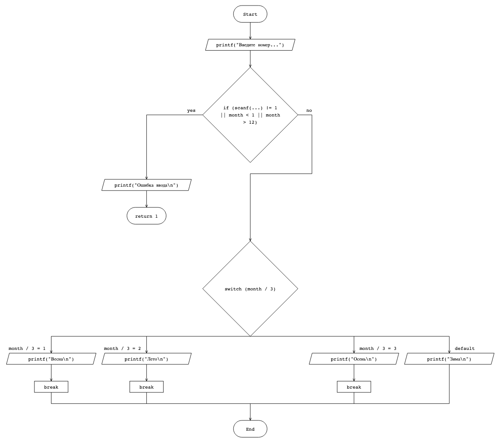
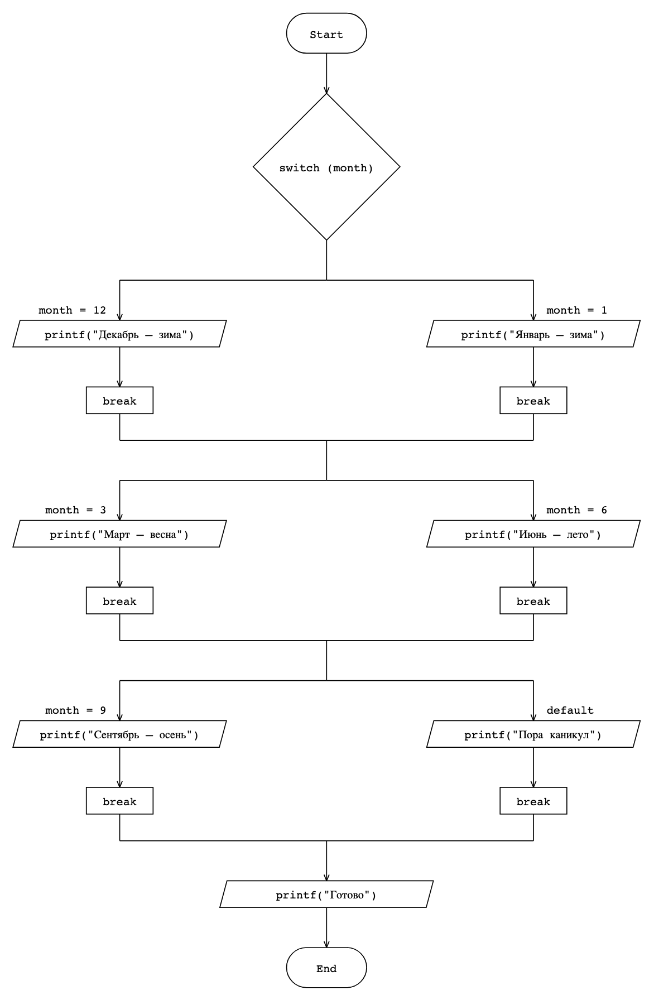

# gostpadi

**Блок-схемы по ГОСТ 19.701-90 из кода на C** — или из простого текстового
файла. Скармливаешь `main.c` — получаешь готовую схему: линии под 90° и
одной толщины, фигуры одного типа — одного размера, ничего рисовать руками
не надо.





## Установка

Ничего ставить не нужно, если есть [uv](https://docs.astral.sh/uv/):

```bash
# установка uv (Linux / macOS)
curl -LsSf https://astral.sh/uv/install.sh | sh

# установка uv (Windows PowerShell)
powershell -ExecutionPolicy ByPass -c "irm https://astral.sh/uv/install.ps1 | iex"
```

Всё — схема из кода одной командой (без клонирования):

```bash
uv run https://raw.githubusercontent.com/sehaxe/gostpadi/main/gostpadi.py \
    main.c --show
```

Классический вариант:

```bash
git clone https://github.com/sehaxe/gostpadi && cd gostpadi
pip install matplotlib
python gostpadi.py main.c
```

## Использование

```bash
gostpadi main.c                 # -> main.png (вписано в А4)
gostpadi main.c --show          # показать схему в терминале
gostpadi main.c -o scheme.svg   # векторный SVG для Word/LaTeX
gostpadi main.c --auto          # размер по схеме, но не больше А4
gostpadi main.c --gvn           # + текст схемы main.gvn (можно править)
```

Что понимает: `printf`/`scanf` (сами параллелограммы), присваивания,
`if/else`, `switch/case/default` (все кейсы на линии из нижнего угла ромба),
`return` (ветка уходит в «End»). Объявления переменных выбрасываются.
Циклы и `else if` пока нет — утилита скажет сама.

Если хочется управлять каждой строкой — есть текстовый формат `.gvn`
(строка = блок, ветки — отступом 4 пробела), см. `examples/*.gvn`.

## Опции

| опция | что делает |
|---|---|
| `-o ФАЙЛ` | имя результата (`.png` или `.svg`) |
| `--show` | нарисовать схему прямо в терминале |
| `--auto` | канвас по размеру схемы, но не больше А4 |
| `--gvn` | сохранить текст схемы `.gvn` |
| `--scale=N` | принудительный масштаб |
| `--font=N` | базовый кегль (по умолчанию 12) |
| `--lw=N` | толщина всех линий (по умолчанию 1.4, единой) |
| `--dpi=N` | плотность пикселей (по умолчанию 200) |
| `--template` | заготовка схемы |

## Проверка

```bash
uv run --with matplotlib python selftest.py
```

## Лицензия

MIT — [LICENSE](LICENSE).
