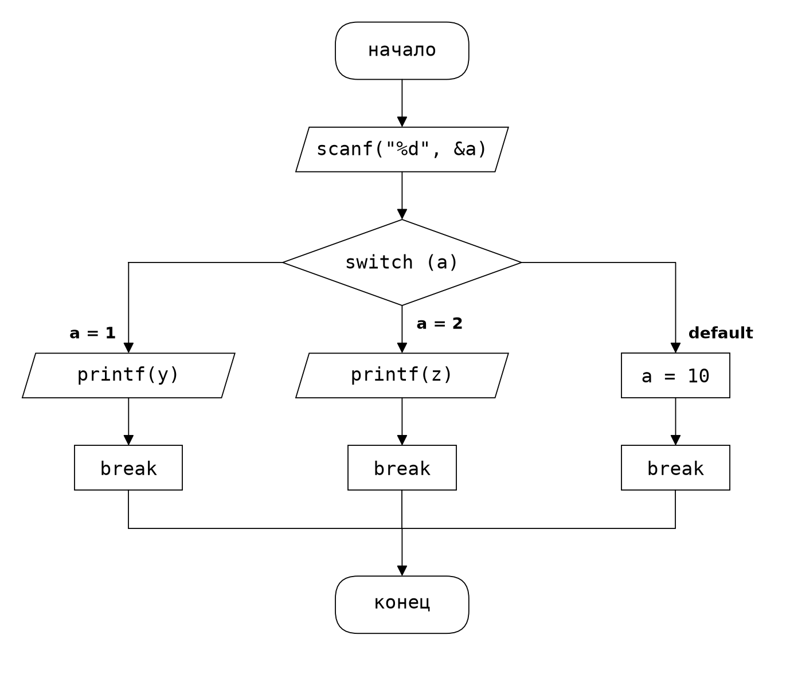

# gostpadi

**Блок-схемы по ГОСТ 19.701-90 из простого текстового формата `.gvn` — или сразу из кода на C.**

Вы описываете только текст блоков и порядок строк — раскладку библиотека делает
сама: все линии строго под 90° и одной толщины, фигуры одного типа — одного
размера, ничего не рисуется руками.



## Почему это удобно

- **Порядок строк = порядок блоков.** Никаких координат, рёбер и точек с запятой.
- **Ветки — отступом.** Сделал отступ в 4 пробела — написал ветку условия.
- **Раскладка сама.** «да» — налево, «нет» — направо, switch — колонка на каждый
  case, все слияния — в точках на основной линии, стрелки входят в фигуры.
- **Схема из кода C.** Скармливаешь `main.c` — получаешь готовую блок-схему.
- **Сам режет на листы.** Не влезло в А4 — части соединяются кружками «А», «Б»…
- **Одна зависимость** — matplotlib.

## Быстрый старт

```bash
uv run --with matplotlib python gostpadi.py схема.gvn --show
```

или классически:

```bash
pip install matplotlib
python gostpadi.py схема.gvn        # -> схема.png
```

`--show` печатает картинку прямо в терминал (kitty / WezTerm / Ghostty /
iTerm2), если он умеет; в любом случае PNG сохраняется.

## Формат .gvn

Первая строка `#gostpadi 1` — подпись формата. Комментарии: `#` и `//`.
Ключевые слова можно писать по-русски и по-английски:

| что | русский | английский |
|---|---|---|
| ввод | `ввод текст` | `input текст` |
| вывод | `вывод текст` | `output текст` |
| действие | `действие текст` или просто текст | `action текст` или просто текст |
| условие | `если усл.` | `if усл.` или голый `switch (x)` |
| ветка в конец | `да -> конец: ...` | `yes -> end: ...` |
| otherwise | `иначе:` | `default:` / `else:` |
| язык надписей | `@labels ru` | `@labels en` |

Пример:

```text
#gostpadi 1
input scanf("%d", &x)
y = x * 2
if y > 10
    yes: printf("big")
    no: printf("small")
output printf("done")
```

`printf`, `scanf`, `read`, `echo` и т.п. узнаются сами и становятся
параллелограммами ввода-вывода; у одиночного `if` второй выход (`no`)
рисуется автоматически; инструкции ветки через `;` становятся отдельными
плитками колонки.

## Схема из кода C

```bash
gostpadi main.c --gvn --show    # main.png + main.gvn (можно сократить и перерендерить)
```

Понимает: `printf`/`scanf` (параллелограммы), присваивания, `if/else`,
`switch/case/default` (подписи становятся `status = 1` … `default`), `return`
(ветка уходит в «конец»). Объявления переменных выбрасываются. Циклы, `else if`
и вложенные `if` в ветках пока не поддерживаются — утилита честно скажет, что
нашла.

## Все опции CLI

| опция | что делает |
|---|---|
| `-o ФАЙЛ` | имя PNG (по умолчанию `<имя схемы>.png`) |
| `--auto` | канвас по размеру схемы, но не больше А4; без разбиения на листы |
| `--scale=N` | принудительный масштаб |
| `--font=N` | базовый кегль (по умолчанию 12) |
| `--lw=N` | толщина **всех** линий и рамок (по умолчанию 1.1) |
| `--dpi=N` | плотность пикселей (по умолчанию 200) |
| `--show` | нарисовать результат прямо в терминале |
| `--labels=ru\|en` | язык подписей схем, сгенерированных из кода C |
| `--gvn` | при входе `.c` сохранить ещё и сгенерированный `.gvn` |
| `--template` | напечатать заготовку `.gvn` |

## Из Python

```python
import gostpadi

gostpadi.render(open("схема.gvn").read(), "результат.png")
gostpadi.render(open("main.c").read(), "из_кода.png")          # .c тоже можно
gostpadi.render(text, "x2.png", page="auto", scale=2.0)        # опции

# или собрать схему из кода
s = gostpadi.Scheme()
s.input('scanf("%f %f", &a, &b)')
s.branch("scanf != 2 || a <= 0 || b <= 0",
         yes='printf("Ошибка..."); return 1 -> end')
s.output('printf("Гипотенуза: %.2f")')
s.render("task.png")
```

## Соответствие ГОСТ 19.701-90

- **Символы** — по стандарту: терминатор, процесс, данные (параллелограмм),
  решение (ромб), соединитель (кружок). Ромб с несколькими выходами из боковых
  вершин (switch) стандартом прямо разрешён.
- **Линии** — ортогональные, одной толщины, сливаются в точках, входят в
  символы со стрелками; текст внутри символов; однотипные символы — одного
  размера; выходы решения — из боковых вершин.
- **Осознанные упрощения** (обычны для учебных схем): все `return` ведут в
  общий «конец»; `break` нарисован как процесс; стрелки стоят на всех входах.

## Примеры

В `examples/`: `hello.gvn` — минимум на английском, `board1_linear.gvn`,
`board2_if.gvn`, `board3_switch.gvn` — шаблоны «как на доске»,
`task1..4.gvn` — схемы реальных лабораторных задач.

## Лицензия

MIT — см. [LICENSE](LICENSE).
