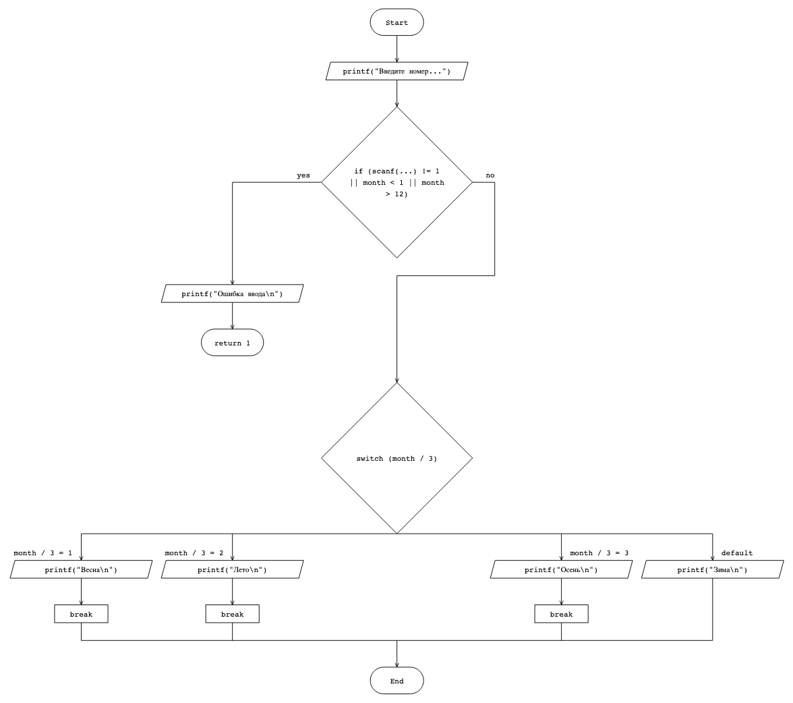
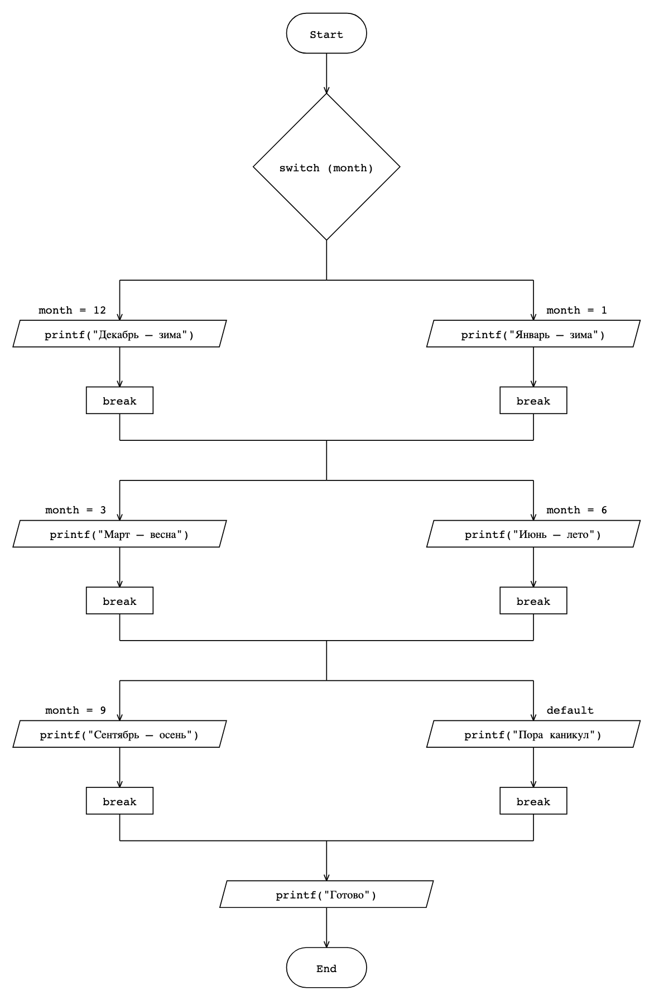

<div align="center">

# gostpadi

**Блок-схемы по ГОСТ 19.701 из кода на C — без рисования руками**

Скармливаешь `main.c` — получаешь готовую схему: линии под 90° и одной
толщины, стрелка на входе в каждый блок, длинные схемы сами режутся
на листы А4.

[](https://github.com/sehaxe/gostpadi/actions/workflows/rust.yml)
[](https://github.com/sehaxe/gostpadi/releases)
[](LICENSE)
[](https://sehaxe.github.io/gostpadi/)

[Установка](#установка) · [Использование](#использование) · [Сайт](#сайт)



</div>

## Зачем

Курсовые и лабы требуют схемы по ГОСТ, а рисовать их в редакторе — боль.
`gostpadi` делает это сам:

- **Из кода** — парсит C (`if`/`else`, `switch/case`, `while`/`for`/`do-while`,
  `return`, `printf`/`scanf`) и строит схему;
- **Из любого кода** — даже битый синтаксис не мешает: непонятные
  конструкции рисуются обычными блоками с исходным текстом, схема
  получается всегда;
- **По ГОСТ 19.701-90** — ромбы 45°, циклы шестиугольником «подготовка»,
  параллелограммы ввода-вывода, модульная сетка 5 мм;
- **В А4** — настоящий лист 210×297 мм с полями ЕСКД (30/10/20/20 мм);
  длинные схемы режутся на листы с кружками-соединителями
  (`--no-split` — наоборот, вся схема одним листом в масштабе пачки);
- **Пачкой** — `gostpadi 1/*.c 2/*.c -o out/`: блоки во **всех** схемах
  одного размера, как и требуют правила оформления отчёта.

Единственный вход — файл с кодом на C. Отдельного текстового формата
больше нет: он был промежуточным звеном внутри движка, и схема проходила
лишнюю сериализацию в текст и обратно.



## Установка

```bash
cargo install --git https://github.com/sehaxe/gostpadi
```

Или готовый бинарник под Linux / macOS / Windows —
в [релизах](https://github.com/sehaxe/gostpadi/releases).

Сборка из исходников:

```bash
git clone https://github.com/sehaxe/gostpadi && cd gostpadi
cargo build --release
# бинарник: target/release/gostpadi
```

## Использование

```bash
gostpadi main.c -o main.svg            # код C -> main.svg
gostpadi 1/*.c 2/*.c -o out/           # пачка: каждой схеме свой .svg
gostpadi main.c --labels=ru            # надписи «начало/конец», «да/нет»
gostpadi main.c --check                # только проверка, без рисования
```

Результат — чистый векторный **SVG** (в Word/LaTeX/браузер без потерь).
Каждый лист — настоящий А4 210×297 мм с полями ЕСКД, содержимое
центрировано в текстовой зоне 170×257 мм.

**Пачка** — для отчёта из нескольких работ: каждой схеме рисуется свой
файл, но **размер фигур, масштаб и сам лист общие на всю пачку** — блоки
во всех схемах одинаковые (ГОСТ 19.701-90 п. 4.1.3), и все страницы
лабы совпадают до миллиметра. Одинаковые имена получают префикс папки:
`1/main.c -> 1-main.svg`.

```bash
gostpadi 1/*.c 2/*.c 3/*.c -o out/   # вся лаба: один лист, один масштаб
```

Если пачка не влезает в книжный лист, движок возьмёт альбомный
(297×210 мм) — но один на всю пачку, чтобы страницы совпадали. Флаг
`--landscape` задаёт ориентацию принудительно. Если масштаб всё равно
опустился ниже читаемого, утилита скажет об этом, а не выдаст тихо
нечитаемый лист.

### Что понимается в коде

| конструкция | как рисуется |
|---|---|
| `printf` / `scanf` | параллелограмм ввода-вывода |
| присваивания, `x = expr` | прямоугольник «процесс» |
| `if / else if / else` | ромб, ветки «да/нет», каскад — вертикальным стволом |
| `switch / case / default` | ромб, кейсы на шине; большой (5+) — сеткой в 2 колонки |
| `while` / `for` / `do-while` | шестиугольник «подготовка», тело возвращается в боковую вершину; у `do-while` в заголовке стоит `do while`, потому что в C условие проверяется после тела |
| `return` | скруглённый терминатор, конец ветки |
| `break` | обычный прямоугольник процесса, как в коде; рельса выхода из цикла не рисуется |
| `continue` | рельса к выходу нижней трапеции цикла (следующая итерация) |
| объявления переменных | с инициализатором — `a = 5`, без него выбрасываются |
| незнакомый синтаксис | блок с исходным текстом: `scanf_s`, макросы, опечатки не ломают схему |

`goto` не поддерживается: метка рисуется обычным блоком, переход — нет.

**Битый код не мешает.** Разбор идёт через tree-sitter и не падает на
синтаксисе: `if {` без скобок, незакрытая `scanf(`, оборванный `for (;;`
дают схему из того, что разобрать удалось, а остальное — блоками с
исходным текстом. Раньше строгий парсер C99 на таком коде завершался
ошибкой и схемы не было вовсе.

### Все опции

| опция | что делает |
|---|---|
| `-o ФАЙЛ/ПАПКА` | имя результата; для пачки — папка (или имя рядом с каждым входом) |
| `--labels=ru\|en` | язык надписей: «начало/конец» и «да/нет» или Start/End и yes/no (по умолчанию en) |
| `--font=N` | кегль текста в pt (по умолчанию 14), растит всю геометрию согласованно |
| `--lw=N` | толщина линий и усиков стрелок (по умолчанию 1.0) |
| `--no-split` | не резать длинную схему на листы: один лист без кружков-соединителей, в А4 его вписывает общий масштаб пачки (для вставки в отчёт — каждая схема на одной странице) |
| `--landscape` | альбомный лист А4 297×210 вместо книжного 210×297; на пачку влияет один раз |
| `--check` | проверить схемы: пересечения, наложения, один вход в «конец» |
| `-h, --help` | справка |
| `-V, --version` | версия |

## Сайт

**[sehaxe.github.io/gostpadi](https://sehaxe.github.io/gostpadi/)** —
лендинг; **[приложение](https://sehaxe.github.io/gostpadi/app.html)** — тот же
движок, что и в CLI, собранный в WASM: перетащи один или несколько
файлов — схемы рисуются прямо в браузере за миллисекунды, код никуда
не отправляется. Скачивание SVG и PNG, шеринг ссылкой на код.

Документация — **[sehaxe.github.io/gostpadi/docs/](https://sehaxe.github.io/gostpadi/docs/)**,
собирается из `site/` (Astro + Starlight, сборка на Bun).

## Как устроен движок

Rust, вывод — SVG без промежуточных растров. Конвейер:

```
код C → tree-sitter → IR → перенос строк → раскладка по модульной
сетке → SVG с одним <g transform> на страницу
```

Парсер отдаёт узлы напрямую, без сериализации в текст: раньше IR
проходил через собственный формат `.gvn` и обратно, и на этом
терялись детали — приходилось возвращать ключевое слово цикла в
текст, чтобы парсер его снял. Перенос строк живёт в раскладке, а не
в парсере: сколько символов влезет — вопрос геометрии.

Пересечения линий и наложения блоков исключаются инвариантами,
проверяемыми в тестах. Геометрия страницы живёт в одном модуле
`sheet`: его спрашивают и порезка, и рендер, и он же решает, книжный
лист или альбомный. Формат чисел, сборка документа и записи в буфер —
без промежуточных аллокаций.

## Разработка

```bash
cargo test                                 # 129 тестов: парсер, раскладка, рендер, CLI
cargo clippy --all-targets -- -D warnings  # линтер
cargo fmt --check                          # форматирование
```

Сайт живёт в `docs/` и грузит `docs/gostpadi.wasm` — его пересобирает CI
на main автоматически. Локальная пересборка:

```bash
CARGO_PROFILE_RELEASE_OPT_LEVEL=z cargo build --release --lib \
  --target wasm32-unknown-unknown
cp target/wasm32-unknown-unknown/release/gostpadi.wasm docs/
```

## Лицензия

MIT — [LICENSE](LICENSE).
